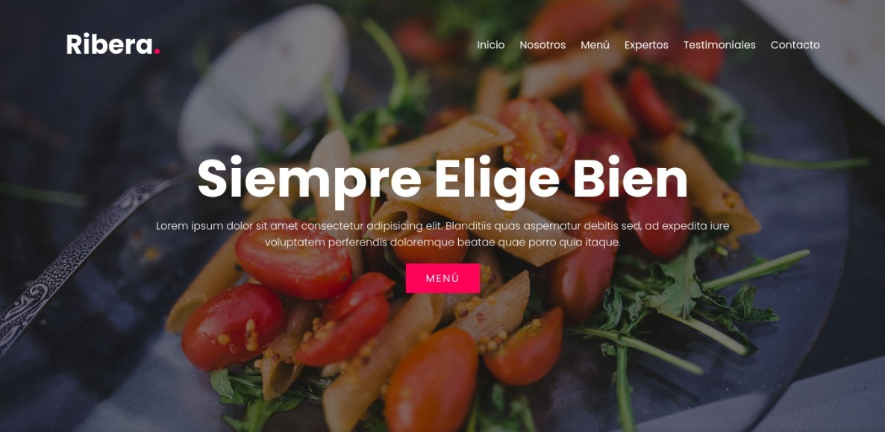

# Ribera

Este proyecto lo hice con HTML, CSS, JavaScript, Sass y Gulp. Es la página de un restaurante en donde se muestran sus platillos, cocineros y las reseñas.

## Contenido

### Sitio

[Ribera.link](https://ribera.netlify.app/)

### Tecnologias utilizadas

- HTML
- CSS
- JavaScript
- Sass
- Gulp
